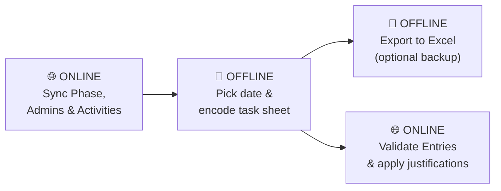
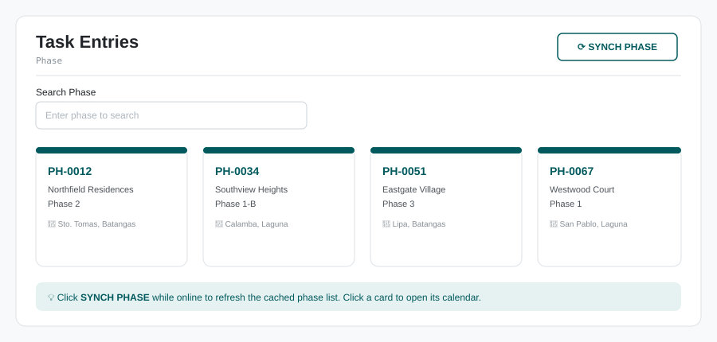
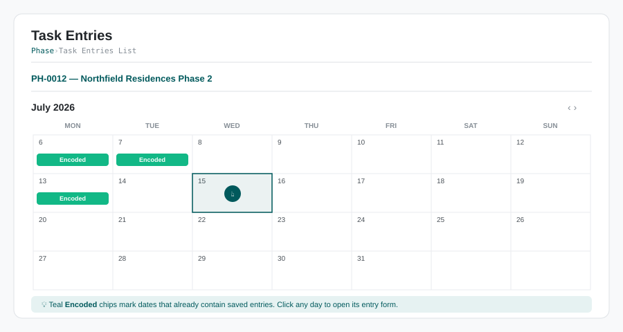
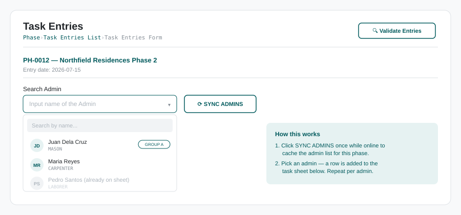
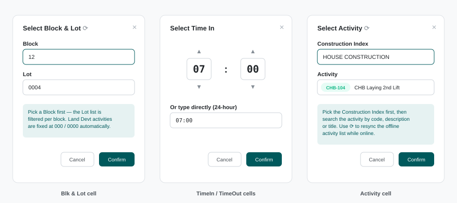
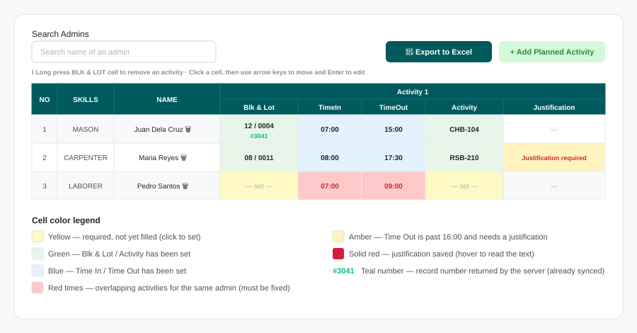
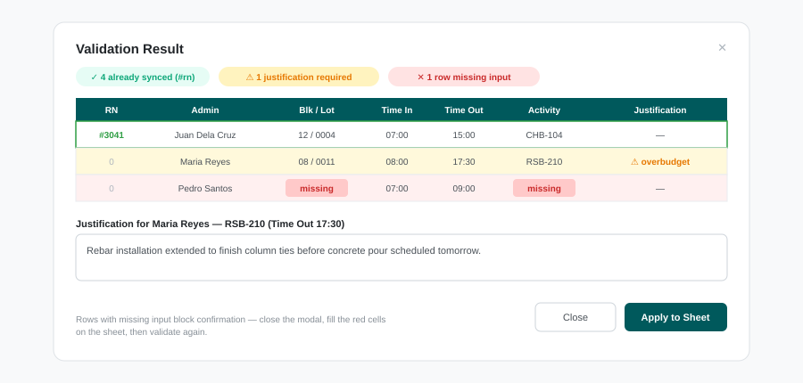

# DAR Encoder — Offline Mode User Guide

**Module:** Task Entries (Offline) · **Route:** `/offline`
**Audience:** Site encoders / timekeepers entering Daily Accomplishment Report (DAR) task entries in the field, with or without an internet connection.

---

## 1. What is Offline Mode?

The Offline Task Entries module lets you encode manual task entries (admin, block & lot, activity, time in/out, justific    ation) **even without an internet connection**. All reference data (phases, admins, activities, blocks & lots) and everything you type is stored locally on your device in the browser's IndexedDB (`AppOfflineDB`), so:

- Nothing is lost when you lose signal, close the tab, or restart the device.
- You only need to be **online twice**: once to *sync reference data down* before going to the field, and once to *validate/sync your entries up* when you are back.

### Workflow at a glance

---

## 2. Before you go offline (one-time sync)

While you still have internet, do the following so the module has everything it needs cached locally:

1. **Log in** to the app normally.
2. Open **Task Entries (Offline)** from the sidebar (route `/offline`).
3. Click **SYNCH PHASE** to download and cache the phase list.
4. Open the phase you will work on, pick any date, and on the entry form click **SYNC ADMINS** — this caches the admin list *for that phase*.
5. Open the **Activity** and **Blk & Lot** cell editors once (or press their **⟳ resync** icon) so the activity list and unit/lot list get cached too.

> ⚠️ **Important:** Admins are cached **per phase**. If you switch to a different phase, sync its admins while you are still online. Do not clear your browser data/site storage — that deletes the offline cache and any unsynced entries.

---

## 3. Step-by-step: Manual Task Entries

### Step 1 — Select a Phase

Open **Task Entries (Offline)**. You'll see the phase cards.

- Use the **Search Phase** box to filter by code, name, or location.
- **SYNCH PHASE** (top right) re-downloads the list — only needed while online when the list has changed.
- **Click a phase card** to continue.

### Step 2 — Pick the entry date

The phase opens in a monthly calendar view.

- Days that already contain saved entries show a teal **Encoded** chip.
- Use the arrows to change months.
- **Click the day** you want to encode for — this opens the Task Entry Form for that date. Each phase + date combination has its own sheet, so you can maintain entries for multiple days independently.

### Step 3 — Add admins to the sheet

1. (Online only, once per phase) Click **SYNC ADMINS** to cache the admin list.
2. Click the **Search Admin** dropdown and search by name.
3. Select an admin — a row is added to the task sheet below. Admins already on the sheet are grayed out so you can't add them twice.
4. Repeat for every admin working that day.

To **remove an admin row**, click the red 🗑 icon beside their name on the sheet.

### Step 4 — Add planned activity columns

Click **+ Add Planned Activity** (top right of the sheet). Each click adds a group of five columns to every row:

| Column | What it holds |
|---|---|
| **Blk & Lot** | Block and lot number the admin worked on |
| **TimeIn** | Start time (24-hour) |
| **TimeOut** | End time (24-hour) |
| **Activity** | The construction activity code |
| **Justification** | Required explanation when TimeOut is past **16:00** |

Add as many activity groups as the busiest admin needs — cells you leave empty on other rows are simply ignored.

### Step 5 — Fill in the cells

Click any cell to open its editor:

- **Blk & Lot** — pick the **Block** first, then the **Lot** (the lot list is filtered per block). The lot's model code is saved automatically.
- **TimeIn / TimeOut** — use the up/down spinners or type the time directly in 24-hour `HH:MM` format.
- **Activity** — pick the **Construction Index** first, then search the activity by code, description, or title.
- **Justification** — type the reason whenever the activity's TimeOut goes past 16:00. The cell shows an amber *"Justification required"* prompt until you do.

> 💡 **Land Devt activities:** when the selected activity belongs to a *Land Devt* construction index, Blk & Lot is fixed automatically at **000 / 0000** and cannot be edited.

**Handy shortcuts on the sheet:**

- **Keyboard navigation** — click any cell once, then use the **arrow keys** to move around and **Enter** to open the editor. Great for fast encoding.
- **Long-press the Blk & Lot cell** (hold ~0.6 s) to delete that single activity entry from that admin's row.
- **Search Admins** box above the sheet scrolls to and highlights the matching row — useful on long sheets.
- Each modal has a **⟳ resync** icon to refresh its reference data while online.

### Step 6 — Read the sheet colors

| Color | Meaning |
|---|---|
| 🟡 Yellow cell | Required field not yet filled — click to set |
| 🟢 Green cell | Blk & Lot / Activity is set |
| 🔵 Blue cell | TimeIn / TimeOut is set |
| 🔴 Red time cells | **Overlapping activities** for the same admin (e.g. 7:00–8:00 vs 7:30–10:00) — fix before validating |
| 🟠 Amber justification cell | TimeOut is past 16:00 and still needs a justification |
| 🟥 Solid red justification cell | Justification saved — hover to read it |
| `#3041` teal number | Server record number (rn) — this entry is already synced to the database |

### Step 7 — Validate and sync (requires internet)

When you are back online, click **Validate Entries** (top right of the form).

What happens:

1. **Overlap check (local)** — if any admin has overlapping time ranges, validation is blocked with a red notification listing who to fix.
2. The sheet is sent to the server (`/TaskSynching`) and the **Validation Result** modal opens:
   - Rows with a **green border and #rn** are already saved in the database.
   - Rows flagged **overbudget** require a justification — type it in the textbox provided.
   - Rows highlighted **red are missing input** (Blk/Lot, times, or activity) and block confirmation — close the modal, fill the red cells, and validate again.
3. Click **Apply to Sheet** — justifications and server record numbers (`#rn`) are written back to your sheet and saved locally.

### Step 8 — Export to Excel (optional)

Click **Export to Excel** any time — online or offline — to download the current sheet as an `.xlsx` file. Use this as a portable backup or for manual submission when connectivity is not available.

---

## 4. Where is my data stored?

| Store (IndexedDB `AppOfflineDB`) | Contents |
|---|---|
| `projects` | Cached phase list |
| `admins` + `currentPhaseData` | Cached admin list for the last-synced phase |
| `sheetRows` | Admin rows you added, keyed per phase + date |
| `taskSheetEntries` | Cell data (blk/lot, times, activities, justifications), keyed `sheet-{phaseCode}-{date}` |
| `taskEntries` | Log of dates opened per phase |

Data persists across page reloads and browser restarts. It is removed only if you clear the browser's site data, or when cell data is deleted through the app itself.

The app also flushes a background **sync queue** automatically whenever your connection comes back (see `useSyncOnReconnect`) — no action needed from you.

---

## 5. Troubleshooting / FAQ

**The admin dropdown shows "No results found" while offline.**
Admins were not synced for this phase. Reconnect, open the form for that phase, and click **SYNC ADMINS**.

**The Activity or Block/Lot picker is empty offline.**
Open those modals once while online (or press their ⟳ icon) so their reference lists get cached.

**"Overlapping activities found" blocks my validation.**
Two or more activities of the same admin share time. The offending TimeIn/TimeOut cells are highlighted red — adjust the times so they don't overlap, then validate again.

**I can't click Confirm in the Validation Result modal.**
Either a required justification is still blank, or a row is missing input (red cells). Complete them first.

**Why can't I edit Blk & Lot for some activities?**
Land Devt activities are fixed at 000 / 0000 by design; a blue notification tells you when you tap them.

**I accidentally added a wrong activity to one cell.**
Long-press (hold) that activity's **Blk & Lot** cell for about half a second to clear the whole entry from that cell.

**Does validating work offline?**
No — **Validate Entries** needs internet since the server checks the entries. Everything else (adding admins, encoding, exporting to Excel) works fully offline once reference data is synced.

---

*Guide generated for the `TaskEntriesOffline` module (`src/Pages/TaskEntriesOffline/`). Screens shown are illustrative mockups — actual UI may differ slightly by version and theme.*
